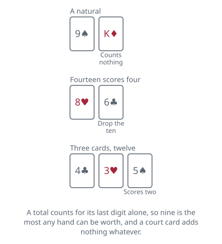

<!-- Generated by packages/build/render-markdown.ts from games/baccarat.json. Do not edit by hand. -->

# Baccarat

**Also known as:** Punto Banco, Baccara  
**Players:** 2-12 players (best with 6)  
**Deck:** 6 to 8 standard decks shuffled together; eight is the casino norm and six is usual online  
**Time:** 30-60 minutes  
**Difficulty:** Easy  
**Category:** Casino  

## Setup

The version played almost everywhere is Punto Banco, and its defining feature is worth knowing before you sit down: after the bet is placed, nobody decides anything. Not the players, not the dealer, not the house. Every card that is drawn is drawn because a printed rule says so, which makes this the only major card game where reading the rules and playing perfectly are the same act.

Shuffle six or eight packs together — eight on a casino floor, six in most online rooms. At home a banker deals, covers the bets and does the arithmetic; the job is mechanical, so hand it round or leave it with whoever is most willing.

Cards are worth their pip value, an ace counts one, and a ten or a court card counts nothing whatever. Totals are taken modulo ten: add the cards up and throw away everything except the last digit, so eight and six is four rather than fourteen. Nine is therefore the best hand available and there is no such thing as going bust.

Two hands are dealt each round and neither of them belongs to anyone at the table. They are called Player and Banker, and those are the names of two piles of cards rather than of any person present — the punter who has staked the most does the honours of turning them over at a full-size table, and it changes nothing. Before the deal, everyone puts money on Player, on Banker, or on the two of them finishing level.

A casino turns the first card of a fresh shoe and burns that many more off the top, then buries a cut card near the bottom — accounts put it at sixteen cards from the end or at seven — and the round in which it appears is the last before the shuffle. At home, shuffle when you are running short.

## Play

Two cards go to each hand and both are turned up. If either shows a total of eight or nine it is a natural, and that settles the drawing question for both hands at once: no third card is dealt to either, whatever the other one holds.

Failing a natural, the Player hand is resolved first, on a rule with no exceptions. Six or seven, it stands. Five or less, it takes one card and only one.

The Banker hand then answers, and what it does depends on whether the Player hand took anything.

Where the Player stood, the Banker follows the same rule the Player just did: draw on five or less, stand on six or seven.

Where the Player drew, the Banker's rule takes account of the card the Player drew — the one piece of information a Banker hand has that a Player hand does not, and the whole reason the Banker bet is charged a commission:

- 7: stand.
- 6: draw only against a 6 or a 7.
- 5: draw against 4, 5, 6 or 7.
- 4: draw against anything from 2 to 7.
- 3: draw against everything except an 8.
- 0, 1 or 2: always draw.

No hand ever receives a fourth card, and the third card, where one is dealt, goes beside the two it is added to rather than replacing anything.

The table looks arbitrary because it is a fossil. Baccarat was once played with both two-card hands hidden and only the third card exposed, and these are the choices a good player would have made knowing exactly that much and no more. When the choices hardened into rules there was no longer any reason to hide the cards, so they came face up and the reasoning behind the table went out of view along with them.

With both hands complete, the totals are compared and the round is settled. Cards are cleared and the next round begins.

## Goal & scoring

Whichever of the two hands finishes nearer to nine takes the round. You played neither of them, so the only thing that matters is which one you put money on.

There are three things to put it on, they cost wildly different amounts, and choosing between them is the whole of the judgement this game asks for:

- Banker, at a long-run cost of about 1.06 percent of what you stake. Make this bet. There is nothing to add to the advice.
- Player, at about 1.24 percent. Entirely defensible, and the worse of the two by a whisker.
- The tie, at about 14.4 percent where it pays 8 to 1 — better than eleven times the price of either alternative, and one of the steepest wagers anywhere in a casino. It happens to be sitting on a table otherwise known for cheap ones, which is presumably the point. British tables mostly pay it at 9 to 1, which cuts the cost to nearer 5 percent and still leaves it the worst bet on the layout.

Why only one of those is taxed: the Banker hand acts last, knowing whether the Player drew and what card it drew, and that extra sight of things makes it come out ahead slightly more often. The five percent taken from a winning Banker bet is what claws the difference back. It is rarely collected hand by hand — a marker goes out against your seat and the whole lot is settled when the shoe runs out. A tie leaves Player and Banker stakes sitting where they are rather than sweeping them away.

Nothing further is available to a player, and it is worth being blunt about that. No decision exists that could be made well. Card counting shifts the edge by about five hundredths of a percentage point, which is a rounding error; counting paired with edge sorting — reading irregularities in the backs of the cards themselves — has been reported to give a real edge, but that is a way of exploiting the equipment rather than of playing the game. The scorecard the casino hands out for recording past results records exactly that and predicts nothing, because a shoe has no memory of what it has already dealt.

No score accumulates between rounds. Play as many as suit you; what is in front of you at the end is the result.

| Scores | Value | Notes |
| --- | --- | --- |
| Ace | 1 | — |
| 2 through 9 | pip value | — |
| 10, jack, queen, king | 0 | — |
| Banker bet | 1 to 1, less 5% commission | — |
| Player bet | 1 to 1 | — |
| Tie bet | 8 to 1 | most British tables pay 9 to 1, which brings the cost down to about 4.85% |
| Tie, holding a Player or Banker bet | stake returned | — |
| Player pair or Banker pair | 11 to 1 | optional side bet: the first two cards of that hand match in rank; the house keeps about 11.3% |
| Either pair | 5 to 1 | either hand's first two cards match; the house keeps about 14.5% |

## Variants

**Chemin de Fer** — The older game, still dealt in a few European casinos, and the one in the early Bond films. A player holds the bank rather than the house, stakes an amount, and the others bet against it up to that total; calling banco covers the whole bank single-handed. Only two hands are dealt and you cannot choose which to back — your money is on the players' side by definition. The player with the largest bet acts for everyone and, crucially, chooses whether to take a third card instead of being told, as does the banker; the two-card hands stay hidden until the decisions are made, which is what makes the choice worth anything. Win or tie and you keep the bank, with the whole of it staked again next time. Lose and it passes on.

**Baccarat Banque** — Also called Baccarat à Deux Tableaux, and the oldest form of the game. The table splits into a left half and a right half, three hands are dealt — one to each side and one to the bank — and each side plays the bank independently, never each other. Betting on either side is allowed at some tables, or à cheval to split a stake across both. The bank is not passed around: one person holds it until the shoe is exhausted, they run out of money, or they choose to stand down, and they have real latitude over drawing. Usually dealt from three packs.

**Mini-baccarat** — The same game and the same odds on a blackjack-sized table, with one dealer handling every card rather than passing the shoe around. It is much faster, which is a mixed blessing when the house has an edge on every hand, but the minimums are a fraction of the big table's and it sits on the main floor instead of behind a rope. Midi-baccarat is the identical arrangement on a larger table, generally in the high-limit room.

**Super 6** — Also sold as Punto 2000, and usually found on a mini table. The five percent commission goes altogether: a winning Banker bet pays even money, except when the Banker wins with a total of exactly 6, which pays only half the stake. That happens about five times in an eight-deck shoe, and it costs more than the commission it replaces — the Banker bet's edge rises from about 1.06 percent to about 1.46 percent, the equivalent of charging nearly 5.9 percent instead of 5. What the casino gets for it is speed, since there is no commission to calculate and collect on every winning hand.

**Reduced commission on Banker** — Casinos occasionally shave the five percent to draw players in. Rates of four percent and 2.75 percent have both been offered, and one Las Vegas casino briefly charged nothing at all in 1989. A related London rule waives the commission on one specific winning hand — a Banker two-card three that beats a Player who drew an 8 — which takes the Banker bet's cost down to around 0.81 percent. Any of these makes the best bet in the house better still, so it is worth reading the felt.

**Tags:** beginner-friendly, betting, classic, large-group, luck

*Rules checked against: Pagat, Wizard of Odds, Wikipedia.*

---

Part of [Naibi](../README.md). Text licensed [CC BY-SA 4.0](../LICENSE).
