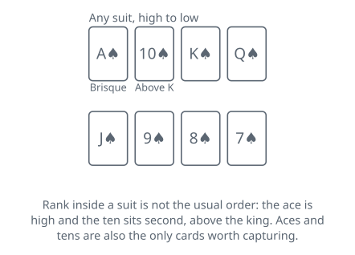
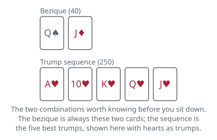

<!-- Generated by packages/build/render-markdown.ts from games/bezique.json. Do not edit by hand. -->

# Bezique

**Also known as:** Bésigue  
**Players:** 2 players  
**Deck:** 2 standard decks stripped to 64 cards (two each of A, 10, K, Q, J, 9, 8, 7 in every suit), made by taking the 2s to 6s out of both  
**Time:** 45-90 minutes  
**Difficulty:** Medium  
**Category:** Trick-taking  

## Setup

Strictly two players, and the first thing to fix in your head is the rank order, because it is not the usual one: A, 10, K, Q, J, 9, 8, 7. The ten sits second, above the king. It is also, along with the ace, one of only two cards worth capturing. Read the ten as a low card and you will spend the evening feeding the two most valuable cards in every suit to the other side of the table.

The pack is 64 cards. Take everything below the seven out of two standard decks and shuffle what remains together, which leaves two copies of every card from the ace down.

Cut for the deal, high card dealing. Eight cards go to each player in packets of three, two and three. The next card is turned face up between you and its suit is trumps for the whole hand; everything still undealt goes face down beside it as the stock.

Keep something to write on. Scores land at odd moments and several of them are large, and nobody can reconstruct them afterwards from the cards on the table.

The non-dealer leads to the first trick.

## Play

A hand comes in two halves that play by different rules, and almost everything that makes the game worth playing happens in the first.

WHILE THE STOCK LASTS

Lead any card you like. Your opponent answers with whatever they please: in this half of the hand, suit and trump alike are entirely free. Whoever showed the highest card in the suit that was led takes the trick, and any trump beats a lead in a plain suit. Because the pack is doubled you will sometimes see the same card twice in one trick; the one played first takes it.

Winning a trick buys you three things in order. You may declare one meld, scoring it immediately. You then draw the top card of the stock and your opponent draws the next, so both hands return to eight. Then you lead to the next trick. The loser of a trick declares nothing, whatever they are holding.

A meld is laid face up in front of you and stays there, but the cards are still yours to play — they go to tricks whenever you choose, and once played they are gone. Every card of a combination has to be in front of you or in your hand at the same moment to score it; nothing already taken into a trick counts toward anything.

A trick buys one scored meld and no more. If laying cards down happens to complete two, say so and score the second after your next trick, assuming it survives that long.

Re-using cards is where the game rewards planning, and it has a rule with a direction to it. A card already melded can join a different kind of combination later, but only one worth more than the one it came from. A king counted in a marriage can go on to be part of four kings; a king counted in four kings cannot be walked back into a marriage. What you may never do is score the same kind of combination twice with the same card — the queen you married cannot be married again to the pack's other king of her suit.

THE SEVEN OF TRUMPS

The seven of trumps, the dix, is worth 10 and is handled apart from the melds. A seven turned up for trumps at the deal scores its 10 for the dealer there and then. Holding one, you may swap it for the turned-up trump card when it is your turn to lead, taking that card into hand and scoring 10. There are two of them in the pack; the second scores its 10 simply for being played to a trick.

The stock runs for twenty-four tricks. On the last of them the winner draws the final face-down card and the loser takes the turn-up, which leaves eight cards each and nothing to draw from.

THE LAST EIGHT TRICKS

Now the game turns strict, and it turns strict in three ways at once. You must follow the suit led if you can. You must beat the card led if you can. If you cannot follow, you must trump. Only a player with neither the suit nor a trump may throw anything.

Nothing is declared in this half. Melded cards on the table are simply part of your hand for the purpose of obeying those obligations, which is what makes an unplayed meld a liability at the end — a row of face-up aces tells your opponent exactly what you are forced to do.

Winning the very last trick of the hand is worth 10. One account instead attaches that 10 to the last trick before this phase begins, so agree which you are using; the same account's own text puts it at the end.

Three penalties are recorded, and they exist because the two-hand game is easy to get quietly wrong. Holding more than eight cards during the first phase gives your opponent 100. Failing to draw after a trick gives them 10. Failing to follow suit or to win when the last eight tricks required it hands them every brisque you have left.

## Goal & scoring

You are playing to 1,000 points, which usually takes three or four hands. Points arrive from two places that pull against each other, and learning which one to chase in a given hand is the whole game.

Melds are the larger source and the more spectacular. They are declared one at a time, only by the winner of a trick, and they run from a plain marriage at 20 up to the double bezique at 500 — a single declaration worth half the game. The bezique itself is the combination the game is named for, and it is fixed rather than following trumps: the queen of spades with the jack of diamonds, whatever suit happens to be trumps that hand.

Brisques are the steady source. Every ace and every ten you take in a trick is worth 10 at the end of the hand, and since the doubled pack holds eight of each there are 160 points sitting in the tricks. They are counted only once the last trick has been played, so it is easy to spend a whole hand chasing melds and discover you have handed over more than a bezique's worth of aces doing it.

That is the tension worth stating plainly. A card kept back for a meld is a card not winning tricks, and an ace thrown to capture a ten is an ace that will not be part of four aces. The player who scores heavily in melds has usually let the brisques go, and the reverse happens just as often.

Memory does the rest. With two of every card there are eight of each rank in play, and the most expensive mistake in the game is holding three queens back for a fourth that has already gone into somebody's trick pile.

| Scores | Value | Notes |
| --- | --- | --- |
| Double bezique (both Q♠ and both J♦) | 500 | — |
| Sequence: A-10-K-Q-J of trumps | 250 | — |
| Four aces | 100 | any four, duplicates allowed |
| Four kings | 80 | — |
| Four queens | 60 | — |
| Four jacks | 40 | — |
| Bezique (Q♠ with J♦) | 40 | fixed; does not follow trumps |
| Royal marriage (K-Q of trumps) | 40 | — |
| Common marriage (K-Q, any other suit) | 20 | — |
| Dix (seven of trumps) | 10 | turned up, swapped or played |
| Last trick of the hand | 10 | — |
| Brisque (each ace or ten taken) | 10 | 160 available per hand |

## Variants

**Rubicon Bezique** — The four-pack game, 128 cards, and one of the two forms one account records as still played in the United States. Nine cards each, and no card is turned for trumps — the suit is set by the first marriage or sequence anybody scores, so the opening tricks are played blind. The dix loses its value entirely, the last trick jumps to 50, and a sequence in a plain suit is worth 150. Beziques multiply: 40, then 500 for two, 1,500 for three and 4,500 for four. Each deal is its own game, scores rounded down to the nearest 100, and the winner takes 500 plus the difference. Fail to reach 1,000 and you are rubiconed, which hands your opponent 1,000 plus both scores added together — so the target is not a finish line but a floor you have to clear.

**Six-pack, or Chinese Bezique** — Rubicon again, scaled up: six packs, 192 cards, twelve dealt to each player. It is the version Winston Churchill played and was an early expert at, and the other of the two forms still recorded in play in the United States. The extra packs make the huge melds reachable rather than theoretical, and a hand takes correspondingly longer.

**Polish Bezique** — One rule changes and the whole game turns over: melds are built only from cards you have captured in tricks, never from your hand. Won tricks stay face up in front of you, and after each one you may score up to two melds, since each of the two cards you have just taken can feed one. Melding also carries on after the stock is gone, which standard bezique forbids. Winning tricks stops being a way of buying the right to declare and becomes the only way to assemble anything.

**Stricter melds** — Two tightenings, recorded as variations rather than as the rule. The bezique may be made to move: when spades or diamonds are trumps it becomes the queen of clubs with the jack of hearts instead, so the combination is never in the trump suit. And a meld of four may be required to hold one card of each suit, which stops the doubled pack producing four kings out of two pairs and makes every such meld considerably harder.

**Carte blanche** — A hand dealt with no ace, ten, king, queen or jack in it can be shown to your opponent and scored for 50. One account records it as a regional addition rather than part of the two-hand game, though it is standard in Rubicon, where you may score it again on every draw until a court card finally arrives.

**Tags:** classic, counting, long-game, strategy, two-player

*Rules checked against: Pagat, Wikipedia.*

---

Part of [Naibi](../README.md). Text licensed [CC BY-SA 4.0](../LICENSE).
