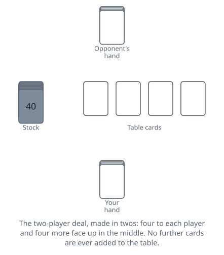

<!-- Generated by packages/build/render-markdown.ts from games/casino.json. Do not edit by hand. -->

# Casino

**Also known as:** Cassino  
**Players:** 2-4 players (best with 2)  
**Deck:** 1 standard deck (52 cards)  
**Time:** 20-40 minutes  
**Difficulty:** Medium  
**Category:** Matching & collecting  

## Setup

Two to four players and one standard 52-card deck. Despite the name, nothing is bet and nobody banks: this is a fishing game, where you catch cards off the table with cards from your hand. It plays best head to head. With four, partners sit opposite each other and pool their captures; with three, everyone plays alone.

Pick a first dealer however you like — low card on a cut is the usual method — and pass the deal to the left after each round.

Deal in twos. Two cards to each player, then two face up to the middle, then two more to each player and two more face up. Everyone ends up holding four cards, with four lying face up in the centre. Put the rest of the deck face down beside the dealer. It is used to top hands up later; no further cards are ever added to the table.

Card values in play: an ace is 1 and numeral cards are worth their pips, which includes the two of spades counting 2 and the ten of diamonds counting 10, regardless of what they are worth at scoring time. Jacks, queens and kings have no numeric value and never take part in any addition.

Each player (or partnership) keeps captured cards in a face-down pile, out of play until the round is scored. The player to the dealer's left starts.

## Play

A turn is a single card, laid face up, and it has to do one of three things: capture, build, or trail. Then play passes to the left. Never more than one card, never fewer.

Capturing. Put your card down and take the table cards it wins, adding them and it to your capture pile.

- By rank: any table card matching what you just laid down. A numeral card takes every match at once, so a 7 collects both 7s if two are showing. A face card takes only one matching face card per turn, even when two or three of its rank are sitting there.
- By sum: any group of numeral table cards whose values add up to your card. A 9 can lift a 4 and a 5, or an ace, a 3 and a 5. Face cards can never be part of a sum.
- Several at once: a single card may take a matching rank, one or more separate summing groups, and any build worth that number, all in the same turn. A 9 could take a loose 9, a 6 with a 3, and a build of nine together.

You are never obliged to take everything on offer. Take whichever legal captures you want.

Building. Lay a card onto one or more table cards, push the lot together into a pile, and announce what it is now worth: "building eight." You must keep a card in hand capable of capturing that number, and you may not build using only cards already on the table.

A single build is one combination adding to the announced number, such as a 3 and a 5 built to eight. Any player holding the right card may capture it, and a single build may be raised by adding one card from hand — laying an ace on a build of eight and announcing nine takes it over, so long as whoever announces nine holds a nine. Raising an opponent's build is legal everywhere. Raising your own is allowed here too — you may add to a build you already own, so long as you still hold a card matching the new number — but some rule sets bar it outright, Royal Casino among them, so settle which you are playing before the first deal.

A multiple build is two or more separate groups worth the same number stacked together, for example an 8 from hand laid on a 5-and-3 build, still worth eight. Once a build is multiple its value is fixed; nobody may raise it, and only a card of that number takes it. Court cards can never go into a build.

You may not trail while a build stands on the table to which you played the most recent card. On such a turn you must capture, add to a build, or start another build — and one of those is always open to you, because the card that made your build legal in the first place is the card that captures it. Once an opponent has added to that build the restriction becomes theirs and not yours.

Trailing. When you cannot capture or build, or simply prefer not to, lay a card face up on the table by itself. It becomes a loose card that anyone may take. Trailing is legal even when a capture was there for the taking; the build rule above is the only thing that ever forces your hand.

Sweeps. A capture that clears the table completely is a sweep. Turn one card in your capture pile face up to record it. The player after a sweep faces an empty table and can only trail.

Refilling and the last trick. Once every hand is empty, four fresh cards go to each player out of the stock, two at a time, with nothing added to the middle. Play carries on the same way. The dealer is obliged to call "last" aloud as the final round goes out, and it is not a formality: play changes once there is nothing more to come. After the very last card is played, whoever made the most recent capture sweeps up whatever is still lying on the table — but that is not counted as a sweep. A real sweep made with the final card of the deal does count.

## Goal & scoring

Casino is usually played to 21 points across several rounds. Eleven is the common short target, and some groups simply play one round for the points on offer and call it a game.

At the end of each round, sort your captured cards and score:

- 3 points for taking the most cards. A tie scores nobody: 26 apiece head to head, or any tie for the lead when three or four play separately.
- 1 point for taking the most spades. Thirteen is odd, so two sides can never tie it; three or four playing separately can, and then nobody scores it either.
- 2 points for big casino, the ten of diamonds.
- 1 point for little casino, the two of spades.
- 1 point for each ace, four in total.
- 1 point for each sweep.

That is 11 fixed points a round, plus however many sweeps were made.

If two players pass the target in the same round, the plain answer is that the higher total wins, and a dead tie means another round. Groups who would rather see the finish decided item by item count them in a fixed order instead — most cards, most spades, big casino, little casino, then the aces of spades, clubs, hearts and diamonds, and the sweeps last of all — and whoever reaches the target first in that sequence takes the game. If the aces have not settled it, the greater number of sweeps does; if those are level too, play a further round.

| Scores | Value | Notes |
| --- | --- | --- |
| Most cards | 3 | a tie scores nobody |
| Most spades | 1 | two sides cannot tie it; three or four playing alone can |
| Big casino (10♦) | 2 | — |
| Little casino (2♠) | 1 | — |
| Each ace | 1 | four in total |
| Each sweep | 1 | — |

## Variants

**Royal Casino** — Court cards get numeric values and join the arithmetic: jack 11, queen 12, king 13. They can be built, captured by sums, and used to capture combinations, which makes builds far more flexible. The ace is usually worth 1 or 14 at the discretion of whoever plays it. Everything else follows the standard game.

**Spade Casino** — The spade suit carries the scoring instead of a single point for holding most of it. Each spade you capture is worth a point on its own, the jack of spades scores an extra one, and the rest of the values are unchanged. Game is 61 and is normally pegged on a cribbage board as the points come in, since the totals move so much faster.

**Draw Casino** — A two-handed game in which the undealt cards stay as a face-down stock and you draw one after every play to keep your hand at four, so there are no separate deals and no announced last round. Once the stock is empty the hands in play are simply played out with no further draws, and as in the standard game whoever made the last capture takes any cards still lying on the table, without it counting as a sweep. It removes most of the counting advantage of the standard game, since you cannot track how many rounds remain.

**Partnership Casino** — The standard four-handed form: two teams of two, partners facing each other across the table, captures thrown into one shared pile and scored as a unit. A build made by one partner may be captured by the other, so builds become a way of passing information and setting your partner up rather than a private plan.

**Tags:** classic, counting, family-friendly, strategy, two-player

*Rules checked against: Pagat, Wikipedia, Britannica, Hoyle's Rules of Games, Denexa Games, GameRules.com.*

---

Part of [Naibi](../README.md). Text licensed [CC BY-SA 4.0](../LICENSE).
