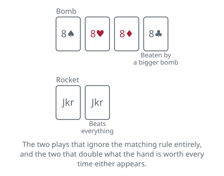

<!-- Generated by packages/build/render-markdown.ts from games/dou-dizhu.json. Do not edit by hand. -->

# Dou Dizhu

**Also known as:** Fight the Landlord, Landlord, 斗地主  
**Players:** 3-4 players (best with 3)  
**Deck:** 1 standard deck with both jokers (54 cards); the four-player version wants two decks and four jokers  
**Time:** 20-45 minutes  
**Difficulty:** Medium  
**Category:** Shedding  

## Setup

Three players, and the shape of the game is one of them against the other two. Whoever wins the auction becomes the landlord, takes the three extra cards, and plays a hand of twenty alone; the other two are peasants, allied for that hand and no longer. Those three face-down cards are what the auction is really for.

The pack is all fifty-four cards, both jokers included, and the jokers have to be distinguishable from one another — one red and one black. Suits are irrelevant everywhere in this game, for combinations, for beating and for anything else.

The ranking takes a minute and then never troubles you again. Bottom to top: 3, 4, 5, 6, 7, 8, 9, 10, jack, queen, king, ace, two, black joker, red joker. The two sitting above the ace is the piece that catches people, and the twos are correspondingly precious.

Nobody deals here; everyone draws for themselves. Somebody shuffles, the player on their left cuts, and the pack goes face down in the middle. Turn one card face up and push it back into the middle of the stack — whoever happens to draw it will open the auction. Players then take cards off the top in turn, anti-clockwise, looking at each as they go, until every hand holds seventeen. Three cards stay on the table, face down and untouched.

## Play

The auction settles who plays alone. Whoever drew the face-up card speaks first, and the only bids available are 1, 2 and 3 — a number of stake units, not of cards or tricks. Each player in turn passes or names a figure above the last. It ends when two players pass in a row, or the moment somebody says 3, since nothing beats it. Everyone passing throws the hand in for a fresh deal.

Whoever bid highest is the landlord. They pick up the three cards waiting on the table, which brings their hand to twenty against seventeen apiece, and the remaining two players are peasants allied for the duration.

The landlord leads, playing any single card or any legal combination. Each player after them, going anti-clockwise, must either pass or beat what is on the table — and beating it means playing the same type of combination with the same number of cards and a higher rank. Not a different shape of the same size: the same shape. A pair answers a pair and a five-card run answers a five-card run, and nothing else will do.

Bombs and rockets are the exception, and the only one. A bomb is four cards of a rank and beats any combination at all except a bigger bomb or a rocket. A rocket is the two jokers together and beats everything in the game.

Play goes round for as many circuits as it takes until two players pass in succession. The cards on the table are then cleared away and whoever played last starts again with anything they like. Passing does not shut you out — you may come back in on a later circuit of the same round.

The combinations, thirteen of them:

- Single card.
- Pair, two of a rank.
- Triplet, three of a rank.
- Triplet plus one loose card, such as 6-6-6-8. The triplet's rank is what counts, so 9-9-9-3 beats 8-8-8-A.
- Triplet plus a pair, a full house in all but name, again ranked on the triplet.
- Sequence, five or more consecutive cards from the 3 up to the ace. Twos and jokers are barred from every sequence in the game.
- Sequence of pairs, three or more consecutive pairs.
- Sequence of triplets, two or more consecutive triplets.
- Sequence of triplets with a loose card attached to each. The attachments must differ from every triplet, though they may happen to pair up with one another. A two or a joker may be attached even though neither can be part of the sequence; both jokers at once may not.
- Sequence of triplets, each one carrying a pair. Only the triplets need to run consecutively. The pairs must differ from one another and from the triplets, and loose cards and pairs may never be mixed inside one play.
- Bomb, four of a rank.
- Rocket, both jokers.
- Quadplex set: a quad carrying two extras. Either two loose cards, whose ranks must differ from each other, or two pairs, likewise differing. The quad fixes the rank. This is the awkward one, and it is worth reading twice: the only thing a quadplex set can defeat is a weaker quadplex built the same way. It takes down no other combination in the game, and any bomb whatever — the very lowest will do — takes it down.

## Goal & scoring

Empty your hand. If the landlord does it first, the landlord has won. If either peasant does it first, both peasants have won together — which is the rule that makes them genuine partners rather than two people who happen to be losing to the same person.

That has a consequence worth stating plainly, because it is the single thing newcomers get wrong. As a peasant, helping your partner go out is worth exactly as much as going out yourself. So you do not beat your partner's cards, you feed them the lead when they are close, and if one of you clearly has the stronger hand the other plays entirely in service of it. A peasant who plays to win personally is playing the wrong game.

The money settles per opponent rather than into a pot. The landlord winning collects the stake from each of the other two; the landlord losing pays it to each of them. The stake starts at whatever the winning bid was — one, two or three units — and then gets multiplied.

Every bomb and every rocket played in the hand doubles the payment, no matter who played it or which side they were on. They stack. A hand bid at 3 that saw two bombs and a rocket is settled at twenty-four units each way, so the arithmetic escalates far faster than the bidding ever suggested and a single defensive bomb can turn a routine hand into the biggest of the evening.

There is a doubling for humiliation at each end. If the peasants never got a single combination onto the table, that is a spring, and the landlord's winnings double again. If the peasants win having let the landlord play nothing beyond their opening combination, the landlord's payment doubles in the same way.

Nothing carries over between hands. Each deal is settled in units and the next auction starts clean.

| Scores | Value | Notes |
| --- | --- | --- |
| Base stake | the winning bid: 1, 2 or 3 | — |
| Landlord out first | each opponent pays the stake | — |
| Either peasant out first | the landlord pays each of them | — |
| Each bomb or rocket played | doubles the payment | by anyone, on either side, and they stack |
| Spring | doubles it again | the peasants never got a combination down at all |
| Spring against the landlord | doubles it again | the landlord played nothing after their opening combination |

## Variants

**Four-player Fight the Landlord** — Played mainly around Zhejiang, Jiangsu and Shanghai. Two packs and four jokers, 108 cards: twenty-five to each player and eight to the landlord, who holds thirty-three against three opponents in partnership. The combinations change to suit the bigger hand. Attaching single cards is dropped entirely, as are quadplex sets. A bomb may be four cards or more, and more cards beats fewer regardless of rank, so a five-card bomb of threes takes out a four-card bomb of aces. A rocket now needs all four jokers, and a red and a black joker cannot be paired together — though two reds or two blacks can, as a pair on their own or attached to a triplet. Only bombs of six cards or more, and rockets, double the payment.

**Showing the landlord's three** — The older practice was for the landlord to pick the three face-down cards up privately, so nobody else ever learned what they were. Turning them face up for everyone to see first has since spread far enough that some accounts simply give it as the rule. It is a real change rather than a courtesy: the peasants learn three of the fifty-four cards and, more usefully, know exactly which cards the landlord did not have when they bid.

**Choosing who opens the auction** — The face-up card buried in the stack is one way of picking the first bidder and not the only one. One house rule gives the opening bid to whoever holds the three of hearts, falling to the four of hearts if nobody has it, and so on upwards. Others simply rotate the privilege one seat per deal in the direction of play, which is the tidiest arrangement for a long session. Online rooms generally just pick somebody at random. It matters more than it sounds, since bidding first means bidding with the least information.

## Background

The name is a fossil. Dou Dizhu means fighting the landlord, and it dates from the land reform campaigns of the 1950s, which set peasants against landlords in earnest. The game came out of Hubei and is now one of the most played in China, and nobody hears the name that way any more.

**Tags:** betting, classic, counting, strategy

*Rules checked against: Pagat, Wikipedia, GameRules.com.*

---

Part of [Naibi](../README.md). Text licensed [CC BY-SA 4.0](../LICENSE).
