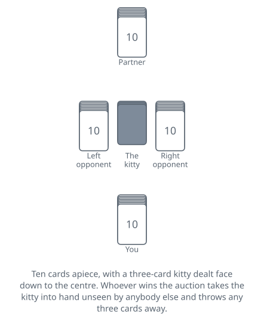

<!-- Generated by packages/build/render-markdown.ts from games/five-hundred.json. Do not edit by hand. -->

# Five Hundred

**Also known as:** 500  
**Players:** 3-5 players (best with 4)  
**Deck:** 1 standard deck cut down to 43 cards — A to 5 in the black suits, A to 4 in the red suits, plus one joker  
**Time:** 45-90 minutes  
**Difficulty:** Complex  
**Category:** Trick-taking  

## Setup

Four at the table in two partnerships, each pair facing one another. Pick a first dealer however you like; from then on everything in this game — dealing, bidding, playing — travels to the left.

The pack is not one you own, so build it. Take a standard deck and throw out every 2 and every 3, then the 4 of spades and the 4 of clubs as well. Put one joker back in. Forty-three cards are left: the black suits running from the ace down to the five, the red suits down to the four, and the joker belonging to no suit at all.

Each player gets ten cards, and three go to the centre of the table face down as the kitty. The traditional rhythm interleaves them: three each and one to the kitty, four each and one to the kitty, three each and the last to the kitty.

One score sheet, two columns, running from zero in both directions. Both directions matters — a side can lose this game by going far enough backwards, and a column that only counts up will not show it coming.

What you are setting up is Euchre with the lid off. The turned-up card is gone and an auction decides trumps instead; whoever wins that auction gets three cards nobody else has seen; hands run to ten rather than five; and one of the contracts on the ladder is an undertaking to lose every trick on purpose. Australia treats the game as a national institution and had nothing to do with inventing it. The game is American and older than 1900, and a playing-card company there took it up and copyrighted a set of rules for it in 1904.

## Play

The auction opens to the dealer's left and goes round as many times as it needs to. Pass and you are out of it for good. Everything else is a claim on a number of tricks, six at the least, played some particular way:

- A number and a suit. Bid eight diamonds and your side has to come home with eight of the ten tricks or better, diamonds being trump.
- A number and no trumps. The same undertaking with no trump suit at all.
- Misère: you will lose every trick, playing alone while your partner lays their hand face down and sits it out.
- Open misère: the same, except that after the first trick you spread your hand face up on the table and play the rest of it in plain view.

Bids outrank each other by tricks first and then by suit, and the suit order is the one thing to memorise: spades lowest, then clubs, diamonds, hearts, and no trumps highest. Six spades is the cheapest bid available and ten no trumps the dearest. The two misères are slotted into that ladder by agreement rather than by trick count, and where they sit is not agreed everywhere. A plain misère sits above every bid of seven and below every bid of eight, and may only be called once somebody has actually bid seven; an open misère outranks ten diamonds, ranks under ten hearts, and may be called at any point, including as the opening bid. Note what that does to the plain misère: at 250 it is worth more than the eight spades it ranks below, and other tables put it between eight spades and eight clubs instead, where its price belongs. That is the ordinary placement in the American game, and it is worth naming before the first auction.

Everyone passing throws the hand in.

The last bidder standing takes the kitty into hand without showing it, then buries any three cards face down — the discards may include cards that came out of the kitty. Those three are out of the game. The contractor then makes the opening lead.

Play itself holds no surprises. Follow the suit led while you hold it and throw whatever you like once you do not; the biggest trump in a trick takes it, and with no trump present the best card of the led suit does; whoever collects a trick leads to the next.

What is not orthodox is the size of the trump suit. Two cards join it and none leaves, so it runs twelve deep when a black suit is trump and thirteen when a red one is, against the ten or eleven an ordinary suit holds in this pack. On top of it is the joker. Under the joker, the right bower, meaning trump's own jack. Under that, the left bower — the matching jack from the suit of the same colour, which has abandoned its printed suit completely and counts as a trump for every purpose there is, following suit included. Then the ace, the king, the queen and straight on down to the ten, since both jacks are elsewhere. The suit that shares trump's colour is left nine or ten cards long with no jack at all.

The joker without a trump suit to belong to needs its own set of rules, and they are worth reading before a no-trump or misère contract rather than during one:

- The contractor, if holding it, may nominate a suit for it before the opening lead, and it is then simply the top card of that suit.
- Unnominated, it belongs to no suit, beats everything, and is restricted instead. Following someone else's lead you may only play it when void in the suit led. Under a misère you must play it when void; under a no-trump contract you need not, and may keep it back.
- You may lead the joker and name a suit that everyone else must follow. How far that privilege runs is not settled between the accounts. On the stricter reading it reaches only a suit nobody has opened yet and expires once all four have been led, the last trick of the hand excepted. The looser reading puts no limit on it at all: the joker may be led whenever you please and named into any suit, including one you hold cards in. Agree which you are playing before a no-trump contract, because it decides whether a joker in hand is a certain trick or a card you can be stuck with.

One trap follows from all that. A misère bidder who keeps the joker and forgets to nominate a suit for it has already lost the contract, because the joker will win the trick it is played to and there is nothing to be done about it.

## Goal & scoring

Five hundred points wins, which is where the name comes from, and there is a condition on it that decides real games: whether arriving there is enough on its own. In the antipodean game it is not — you have to get there on a hand you bid and made, so points picked up defending somebody else's contract will carry you past 500 and leave you sitting there unable to finish, playing on until you win a contract of your own. American practice is the other way and lets those points win outright, giving the game to the contractor if both sides cross 500 on the same deal. Settle it before you start. There is also a back door, and on that both accounts agree. Reach minus 500 and you have lost the game outright, without anyone having to win it.

What a contract is worth looks like a table to memorise and is really one formula. Six spades is 40. Every extra trick you undertake adds 100, and every step up the suit order — spades to clubs to diamonds to hearts to no trumps — adds 20. So eight hearts is 40, plus 200 for the two tricks above six, plus 60 for hearts being three steps above spades: 300. The two misères are priced flat, at 250 and 500, and their prices do not line up with the ladder: 250 is worth more than the eight spades a plain misère is outbid by.

Take the tricks you bid and your side scores the contract's value. Extra tricks beyond the bid earn nothing at all, with one exception: sweep all ten and a contract worth less than 250 pays 250 instead. Above 250 there is no bonus, because you were already being paid enough.

Fall short and the same number comes off your score instead, which is how a side ends up going out backwards. A greedy ten no trumps that fails costs 520 in a single hand and can lose the game on its own.

The defenders score 10 a trick for every trick they take, and they score it whether the contract stood up or not. This matters more than it looks: it means defending is never wasted effort, a hopeless hand is still worth fighting for scraps in, and a side can climb most of the way to 500 on other people's contracts — only to find, where a bid is required to go out, that they still have to win one to close it.

Misère pays nothing to the defenders either way. The contractor either loses every trick and takes 250 or 500, or wins one and drops the same amount.

| Scores | Value | Notes |
| --- | --- | --- |
| Six tricks | 40 to 120 | spades 40, clubs 60, diamonds 80, hearts 100, no trumps 120 |
| Seven tricks | 140 to 220 | — |
| Eight tricks | 240 to 320 | — |
| Nine tricks | 340 to 420 | — |
| Ten tricks | 440 to 520 | — |
| Misère | 250 | above any bid of seven and below any bid of eight; ranked by its price in the American game |
| Open misère | 500 | outranks ten diamonds, ranks below ten hearts |
| Slam on a contract worth under 250 | 250 instead of the bid | — |
| Contract failed | minus its full value | — |
| Each trick taken by the defenders | 10 | scored win or lose, but never against a misère |
| Winning the game | 500 | on a hand you bid and made, where that is required; minus 500 loses outright |

## Variants

**Three-handed** — Cut the pack down again so that the seven is the lowest card in every suit, giving 33 cards with the joker, and deal ten each with a three-card kitty as usual. There are no fixed partnerships: whoever wins the auction plays alone and the other two combine against them for that hand only. Every player keeps their own score, and the same conditions apply — 500 or more on a contract of your own wins, minus 500 loses. The contractor gets no help at all, and the two defenders have to work out between them who is covering what, having agreed nothing beforehand. One change to the bidding goes with the smaller table: a misère may be called without anyone having bid seven first, seven-trick bids being rarer with no partner to lean on.

**Five-handed** — Use the whole 52-card deck plus the joker, 53 in all, and deal ten each with the usual kitty. After discarding, a contractor playing a suit or no-trump contract either announces they are going alone against the other four, or calls a single card to find a partner by: whoever holds it plays alongside them, two against three. Which cards may be called is not settled — one account bars the joker and both bowers, another has a bower as the ordinary choice and bars trumps only at some tables — and neither is whether the holder owns up at once or keeps quiet, leaving the partnership to surface when the card is played. In some circles a contractor may also name a card they hold themselves or have already buried, which is how you play alone without announcing it. A called partner shares the contract's value or its loss, half each on one account and the full amount each on another; a contractor going alone takes all of it. Misère is played single-handed against the other four wherever it is allowed at all, and both accounts report it barred or repriced at this size as too easy for its score.

**Six-handed** — Two partnerships of three, sitting alternately, playing by the four-handed rules. It wants a purpose-made 63-card pack with 11s and 12s in every suit and 13s in the red suits, ranking between the 10 and the jack — these are sold as six-handed 500 decks, and one account reports Australian players using the same pack for the four-handed game with the extras taken out. Without one, make the count up out of a second pack: its 2s, its 3s and its red 4s. Agree in advance that when the same card lands twice in a trick, the earlier of the two takes it. Under a misère both of the contractor's partners lay their hands down. Six can also be played as three pairs rather than two threes.

**The joker in no trumps** — How the joker behaves without a trump suit is one of the game's recognised areas of dispute, and it is the thing to agree out loud rather than discover in the middle of a 500-point contract. Two changes turn up in both accounts. The first tightens the joker: it may not be played to a suit you have already shown void in, so having thrown a spade on somebody's diamond lead you cannot come back and take a later diamond with it. One account exempts the case where the joker is the last card you hold; the other says that in exactly that position it loses the trick to the best card of the suit led. The second change loosens the lead instead, letting the joker be led to any trick at all and named into any suit you have not shown void in, whether or not that suit has been opened. Two narrower forms are also recorded. In one, the joker cannot open a trick until the final one, and serves only to take a suit you are void in. In the other, you may put it down in a given suit at your first card of that suit or at your last, and nowhere between. One account further describes tables that drop the advance nomination in no-trump contracts while keeping it available for a misère.

**Tags:** classic, counting, long-game, partnership, strategy

*Rules checked against: Pagat, Wikipedia, GameRules.com.*

---

Part of [Naibi](../README.md). Text licensed [CC BY-SA 4.0](../LICENSE).
