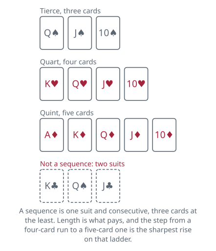

<!-- Generated by packages/build/render-markdown.ts from games/piquet.json. Do not edit by hand. -->

# Piquet

**Also known as:** Rubicon Piquet  
**Players:** 2 players  
**Deck:** 1 standard deck stripped to 32 cards (A, K, Q, J, 10, 9, 8, 7 in each suit)  
**Time:** 45-75 minutes  
**Difficulty:** Complex  
**Category:** Trick-taking  

## Setup

Take a pack and throw out everything from the six down, leaving thirty-two cards running seven, eight, nine, ten, jack, queen, king, ace, with the ace high. There is no trump suit in this game at any point.

Cut for the deal. The small edge in a partie belongs to whoever does not deal its sixth and final hand, and because the deal alternates that is the player who dealt the first one — so the winner of the cut should elect to deal.

Twelve cards to each player, in twos or threes as the dealer prefers, and the remaining eight go face down in the middle as the talon. Whichever rhythm the dealer picks, they must use it for their other two deals.

The names matter and will be used throughout. Whoever dealt is younger hand for that deal; their opponent is elder hand. Elder does nearly everything first — exchanges first, declares first, leads first — and that head start is the compensation for not having dealt.

One thing is worth checking before anything else happens. A hand containing no jack, queen or king at all is carte blanche and scores 10 outright. Say so the moment you notice. You prove it by dealing your hand rapidly face up after your opponent has discarded and before you discard yourself — and if you are elder, you have to announce how many cards you mean to exchange first, so that younger can choose their own discards without having seen your hand.

## Play

The exchange comes first and is the hardest decision in the game. Elder discards between one and five cards face down and draws the same number off the top of the talon. Younger then discards between one and whatever elder did not take — three, ordinarily — and draws to match. Anyone taking fewer than their maximum must say so before drawing. Keep your own discards beside you; you are allowed to look back at them later, and you will want to.

What the two players are doing is different. Elder, with five cards and the lead, should be building the best hand available and not thinking about defence at all; it is almost always right to take the full five. Younger, with three, has to hedge — hold something that stops elder's long suit, keep a guarded queen or king where you can — while still going for combinations. The asymmetry is the game.

A courtesy that follows from the arithmetic: elder taking fewer than five may look at the rest of the five, and younger taking fewer than allowed may show the leftovers to both players once elder has led.

Then the declarations, which is where most of the points are. Three categories, and in each one only the better holding scores anything at all:

- Point — your longest suit, scoring one for each card in it.
- Sequence — three cards or more, all of one suit and adjacent in rank, counting the longest such run you hold.
- Set — three or four cards of one rank, and only ranks of ten or better; nines, eights and sevens do not count.

Elder announces first, taking the categories in that order, and younger answers each announcement with one word. "Good" concedes it. "Not good" claims a better one. "Equal" asks for more detail, and elder gives it — and if the two are genuinely identical, neither player scores that category at all.

Ties break like this. Points of the same length are settled on pip total, counting each court card as ten and each ace as eleven. Sequences of the same length are settled on the top card, so ace-king-queen beats king-queen-jack. Any four of a kind beats any three, and two of the same size are settled on rank.

Winning a category is worth more than the one combination that won it: whoever has the best sequence also scores every other sequence in their hand, and whoever has the best set scores their other sets too. The loser of the category scores none of theirs, however many they were holding.

You are not obliged to declare anything. Sinking a declaration — staying quiet about a holding you expect to lose, or one that would tell your opponent too much about your hand — is legitimate and sometimes correct. The price is that it is irrevocable: once elder has announced something, elder cannot go back and claim a better one after hearing "not good".

Elder then leads to the first trick, and only after that lead does younger announce and score the categories where they said "not good" or where elder stayed silent.

Twelve tricks are then played out. Nothing is trump, following the led suit is compulsory, and either player may look back through the completed tricks whenever they like. Points come in a steady trickle: one for leading to a trick, one more for taking a trick that your opponent led, and one extra for taking the last one.

## Goal & scoring

A match is a partie of six deals with the deal alternating, and the higher total at the end of it wins. Level after six, play two more; level after those, call it a draw.

Each player calls out their running total for the hand as they score, so both totals are public throughout — there is no hidden bookkeeping in Piquet, only hidden cards.

The margin is what is actually settled, and there is a trapdoor in it. Beat your opponent and you take the difference between the two totals plus 100. But if the loser failed to reach 100 points across the whole partie, they have not got over the rubicon, and instead of the difference you take the sum of both scores plus 100. The effect is brutal and deliberate: losing 99 to 120 costs 319, while losing 101 to 120 costs 119. Scraping past 100 is worth more to a losing player than almost anything else on the table.

The two big bonuses are what make an ordinary hand occasionally enormous.

Repique is worth 60, and goes to a player who reaches 30 in declarations alone before their opponent has scored anything whatever. For deciding whether that happened, the score is reckoned in a strict order regardless of when things were said: carte blanche, then point, then sequences, then sets, then anything made in play. So a player who racks up 30 from sequences and sets does not get a repique if the opponent held the better point, because the point is counted first.

Pique is worth 30, for reaching 30 from declarations and play together before the opponent has scored at all. Here the points count in the order they genuinely fell, which quietly puts the bonus out of younger hand's reach for good. Younger declares nothing until elder has led, and that lead is itself worth a point — so by the time younger can score at all, the opponent is never on nothing. Pique is elder's bonus and nobody else's. The 40 for capot cannot be counted towards the thirty; whether the 10 for the cards may is disputed, and the variants take it up.

A category that ties, with neither player scoring, does not shield anybody from either bonus.

At the end of the twelve tricks, whoever took the majority scores 10 for the cards. Six tricks each scores nobody anything. Taking all twelve is capot and pays 40 in place of the 10 — rare, and usually the end of that partie's suspense.

| Scores | Value | Notes |
| --- | --- | --- |
| Carte blanche | 10 | a hand with no jack, queen or king; announce it at once |
| Point | 1 per card | longest suit; ties on pip total, courts 10 and aces 11 |
| Tierce, a sequence of 3 | 3 | — |
| Quart, a sequence of 4 | 4 | — |
| Quint, a sequence of 5 | 15 | — |
| Sixième, a sequence of 6 | 16 | — |
| Septième, a sequence of 7 | 17 | — |
| Huitième, a sequence of 8 | 18 | — |
| Trio, three of a rank | 3 | tens or better only |
| Quatorze, four of a rank | 14 | tens or better only; beats any trio |
| Leading to a trick | 1 | — |
| Taking a trick you did not lead | 1 | — |
| Taking the last trick | 1 extra | — |
| The cards | 10 | for taking seven tricks or more; nothing is scored at six all |
| Capot | 40 | all twelve tricks, in place of the 10 |
| Repique | 60 | 30 from declarations alone before the opponent has scored |
| Pique | 30 | 30 from declarations and play before the opponent has scored |
| Winning the partie | the margin plus 100 | or both scores plus 100 if the loser fell short of 100 |

## Variants

**Piquet au cent** — The older game the modern one grew out of, and still played. Instead of a fixed six deals, a game runs until somebody reaches 100 points or more, and getting there while your opponent is still short of 50 wins a double game; a partie is then the best of five games, with a double counting as two. The rubicon disappears along with the six-deal format, which changes the whole shape of a losing position — there is no longer any reason to grind out a hundred, only to arrive first. Accounts differ on how much else travels under the name: some treat it simply as a different finish, others as the full early package described below.

**The early thirty-six card game** — How Piquet was played around 1650, and worth trying once for the shape of it. The sixes stay in, making thirty-six cards; the talon is twelve rather than eight; and elder hand may exchange up to seven. With that much of the pack passing through the players' hands the declarations grow far bigger and far more contested, and the discard — already the hardest decision in the modern game — turns into something close to a puzzle. It is normally played to a hundred points, which is why some writers file it and Piquet au cent under a single heading.

**Trick points only for tens and above** — Found in some forms of the hundred-point game. A point is scored during play only when the card led, or the card that takes the trick, is a ten or better; anything lower earns nothing. The consequence is the interesting part. In the standard game elder hand banks a point for leading to the first trick no matter what it is, and that is precisely what puts a pique out of younger hand's reach forever. Under this rule an elder who opens with a nine, an eight or a seven scores nothing at all — and younger can score a pique after all.

**Ten for the last trick** — Award 10 points for taking the final trick instead of the customary 1. A small change on the score sheet and a large one to the endgame: keeping a stopper back for trick twelve stops being worth a tidy extra point and becomes worth as much as the cards, so both players have to plan the closing tricks rather than simply cashing winners in order.

**Claiming the cards early** — Settle this one before you start, because the published accounts part company over it. On one reading, a player who has taken seven tricks may announce the 10 for cards at that moment and count it towards the thirty needed for a pique. On the other, the 10 is not settled until the play is over, by which time the opponent has almost certainly scored something and the question cannot arise. The disagreement is traced to a nineteenth-century law that rules a capot out of a pique and says nothing either way about the cards. Piques are a good deal easier to come by under the first reading, which is reason enough to agree on it in advance.

## Background

Piquet was already well established by 1650 in a form a modern player would recognise, and for exactly two people there is still very little to touch it — though it is a game for enthusiasts now rather than a household fixture, and has been since about 1918. What follows is the version the English-speaking world settled on from the late nineteenth century, codified by Cavendish in 1882 and known in the books as Rubicon Piquet — the older hundred-point game is in the variants. It asks a lot at the start — there is French vocabulary, there are three separate scoring categories before a card is played, and there are two bonuses large enough to decide a match on their own — and it repays every bit of it. Learn it over an evening rather than in ten minutes.

**Tags:** classic, counting, long-game, strategy, two-player

*Rules checked against: Pagat, Wikipedia, Parlett Games.*

---

Part of [Naibi](../README.md). Text licensed [CC BY-SA 4.0](../LICENSE).
