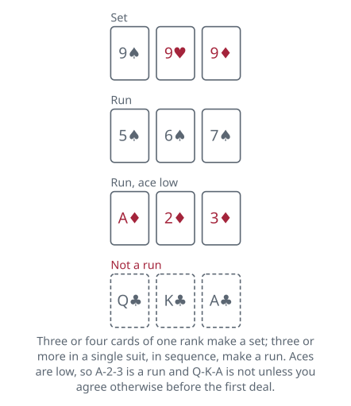

<!-- Generated by packages/build/render-markdown.ts from games/rummy.json. Do not edit by hand. -->

# Rummy

**Also known as:** Rum, Straight Rummy, Basic Rummy  
**Players:** 2-6 players (best with 4)  
**Deck:** 1 standard deck (52 cards)  
**Time:** 20-45 minutes  
**Difficulty:** Easy  
**Category:** Rummy family  

## Setup

Use one 52-card pack with the jokers removed. Any fair method picks the first dealer; drawing cards and giving the deal to the highest is common, with tied drawers drawing again. The deal then passes to the left after each hand, which means it simply alternates in the two-player game.

How many cards you get depends on the size of the table. With two players, deal 10 each. With three or four, deal 7 each. With five or six, deal 6 each. Deal one card at a time, face down and clockwise, beginning on the dealer's left.

What is left becomes the stock, face down in the middle, with a single card turned beside it to open the discard pile. Only the top card of that pile is ever available, so keep it squared up rather than spread.

Aces are low. A-2-3 is a run and Q-K-A is not, unless you agree otherwise before the first deal. For scoring, an ace is 1 point, each numbered card is worth its number, and a jack, queen or king is 10. The player to the dealer's left takes the first turn.

| Players | Each player gets |
| --- | --- |
| 2 | 10 cards |
| 3 | 7 cards |
| 4 | 7 cards |
| 5 | 6 cards |
| 6 | 6 cards |

## Play

You are trying to get rid of every card in your hand by arranging them into melds. A set is a rank collected up: three nines, or all four of them. A run is three or more cards of one suit in sequence, such as 5♠ 6♠ 7♠. A card can only belong to one meld at a time.

A turn has three parts and always happens in this order.

First, draw. Take either the top card of the stock, sight unseen, or the top card of the discard pile, which everyone can see. You draw exactly one card, and you may not dig deeper into the discard pile.

Second, meld if you want to. Lay any complete set or run from your hand face up in front of you. You may also lay off: add a card to any meld already on the table, yours or an opponent's, by putting a fourth card on a set or extending either end of a run. Laying off is how single cards get used up late in a hand; the card you add simply becomes part of that meld, and since melds score nothing for anybody in the basic game it does not matter whose spread it joined. Melding is always optional, even when you can. Holding a completed meld back keeps your options open but risks getting caught with it.

Third, discard. Put one card face up on the discard pile. That ends your turn and passes play to the left. The one thing you cannot do is take the top discard and immediately throw the same card back.

Two points worth agreeing before you deal, because tables differ and the accounts of the game differ with them. One meld a turn is the older rule and the one still written down as standard, though plenty of groups let you lay down as many as you like. Laying off runs the other way: some accounts let you add to anybody's melds from the start, and others hold you back until you have laid down a meld of your own.

The hand ends when somebody goes out, which means playing their last card. You can go out by melding, by laying off, or by discarding your final card, and any mix of those in one turn. In the basic game you do not need to keep a card back for a final discard, though a good number of households insist on it.

If nobody has gone out by the time the stock is empty, take the discard pile, leave its top card where it is as the only card of a new discard pile, and turn the rest face down as a fresh stock. Shuffling that new stock first is common and harmless. The player who found the stock empty draws from the new one and finishes their turn as normal, and play continues to the left. A stubborn hand can in principle circle for ever, so cap it before you start: ending after the stock has run out for the third time, or allowing the discard pile just one reuse, are both suggested. When the cap is reached the hand ends and the cards are scored as they stand.

Going out in a single turn, with no previous melds or lay-offs at all, is going rummy and pays double. To do it you must put your entire hand down on one turn, having laid nothing on the table earlier in the deal.

## Goal & scoring

The object of each hand is to be first to shed every card. Play runs to an agreed target, over as many hands as that takes. No figure is standard, so pick one before the first shuffle — or agree a fixed number of deals instead, which works just as well.

When a player goes out, everyone else counts the cards still in their hand. Melds already on the table do not count for or against anybody, and neither do cards you laid off. Aces are 1, numbered cards are face value, and jacks, queens and kings are 10 each. The winner of the hand scores the sum of everything all the other players are left holding.

Going rummy doubles the whole amount collected for that hand.

The common alternative is penalty scoring: instead of the winner collecting, each losing player writes down the value of their own leftover cards as a plus score, the winner writes zero, and the game runs until someone crosses an agreed limit, at which point the lowest total wins.

Ties are settled the same way under either method: if two or more players are level for the win once the target has been passed, deal again and keep playing until one of them is clear on their own.

## Variants

**Block Rummy** — The discard pile is never recycled. When the stock runs out and the next player does not want the top discard, the hand stops there and nobody goes out. Everyone counts the cards in their hand as penalty points, including the player who would otherwise have won. It makes hoarding a big hand far more dangerous and speeds the game up noticeably.

**Boathouse Rum** — A sharper two-player version. If you take the top discard you must then draw a second card, either the next discard or the top of the stock, but you still discard only one, so your hand grows. An ace may be used high or low, but not both ends at once, and it costs 11 points if you are caught holding it. You may not meld or lay off at all until the turn on which you go out, so every hand is played entirely from concealment.

**Knock Rummy** — Also called Poker Rum. Nothing is laid on the table during play. Instead, any player may end the hand on their turn by discarding face down and knocking, then spreading their hand. Everyone reveals, counts their unmelded cards, and the lowest count wins the difference from each of the others. A knocker who turns out not to be lowest usually pays a flat 10-point penalty to the player who is, on top of the differences, and a tie for lowest is normally judged against the knocker. Many tables also pay the knocker an agreed bonus, commonly 25, for knocking with a count of zero. The bluff is in deciding how early you dare to stop the hand.

**Wild cards** — Add one or two jokers, or nominate a rank such as deuces, as wild cards that can stand in for anything in a meld. A common accompanying rule lets a later player swap the natural card for a wild one sitting in a meld on the table and take the wild card into hand. Wilds usually carry a heavy penalty value, often 15 or 20 points, if you are caught holding one at the end of a hand.

**Tags:** beginner-friendly, classic, counting, family-friendly, luck, strategy

*Rules checked against: Pagat, Bicycle Cards, Wikipedia, Britannica, Official Game Rules, Denexa Games.*

---

Part of [Naibi](../README.md). Text licensed [CC BY-SA 4.0](../LICENSE).
