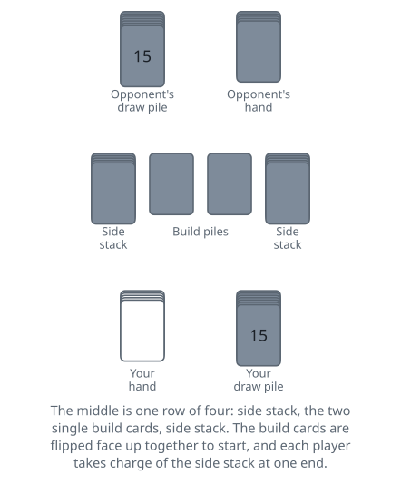

<!-- Generated by packages/build/render-markdown.ts from games/speed.json. Do not edit by hand. -->

# Speed

**Also known as:** Slam  
**Players:** 2-4 players (best with 2)  
**Deck:** 1 standard deck (52 cards), jokers removed  
**Time:** 5-15 minutes  
**Difficulty:** Easy  
**Category:** Shedding  

## Setup

Speed is for two players and uses all 52 cards with the jokers taken out. Anyone may deal; over a match, either alternate the deal or let the loser of the previous round deal, since it confers no advantage. Shuffle and deal 20 cards to each player: 15 face down as a personal draw pile, and 5 more as a hand you pick up and hold where your opponent cannot see it. That accounts for 40 cards; the remaining 12 build the middle.

The split varies. One account deals only 15 to each player — a hand of five and a draw pile of ten — and puts ten cards at each end of the middle instead of five. The pack comes out exactly either way; what changes is how long the reserves last before the middle has to be rebuilt. Settle which of the two you are dealing before you shuffle.

Lay the middle out as a single row between you, running left to right: a face-down stack of 5, a single face-down card, a second single face-down card, then another face-down stack of 5. The two single cards in the centre will become the build piles that everyone plays onto. The stacks of five on either end are the side stacks, held in reserve for when play jams.

Put your draw pile face down at your right hand, where you can reach it without looking, and pick up your five-card hand. The two side stacks sit at opposite ends of the row and a card comes off each of them at the same moment, so the two of you have to be looking after different ends. Agree which end is whose before you start, rather than both reaching for the same stack.

When both players say they are ready, each of you puts a hand on one of the two centre cards and you flip them face up together. The game starts the instant they land, so agree on a count first if you want it fair.

## Play

There are no turns. Both players play at the same time, as fast as they can manage, and the game runs continuously until someone goes out.

A card is legal on a centre pile if its rank is exactly one higher or one lower than the pile's current top card. Suits are ignored completely. Ranks wrap around at the ace: an ace plays on a king or on a 2, and a king or a 2 plays on an ace. The wrap does not let you skip, so a king can never go straight onto a 2. If the two centre piles show a 9 and a queen, the only cards you can put down are an 8 or a 10 on the first and a jack or a king on the second.

You play from your hand only, one card at a time, and your hand holds a maximum of five cards. Whenever you have fewer than five you may draw from your own draw pile to top back up. You can do this at any moment and as often as you like, which makes play a card, draw a card the natural rhythm. There is no obligation to draw the instant a slot opens, but hoarding one only starves you of options. Once your draw pile is exhausted you simply play out whatever is left in your hand.

Because both players are reaching for the same two piles, collisions happen constantly. There is no taking a card back once it has touched a pile, and the moment it lands your opponent is free to build on it, which settles a race by itself: the hand underneath has played, and the card that arrived on top of it either fits the card now showing or was never a legal play. Play one card at a time with one hand and do not stack several cards down at once.

When neither player can play anything, the game is stuck. Both players then take the top card of their own side stack and flip it face up onto the centre pile next to it, doing so at the same time. That gives two fresh top cards and play resumes instantly. Being stuck means neither player has a legal card in hand, not that either of you has run out of cards — and it is only a jam once both hands are back up to five, so top yours up first if your draw pile still has cards in it.

Work through the side stacks a card at a time as further jams occur. When both side stacks are empty and play jams again, the middle is rebuilt out of what has been played onto it, and accounts differ on how. One leaves the top card of each centre pile where it is and shuffles everything underneath the two of them into fresh side stacks, so play resumes on the same two ranks. The other shuffles each centre pile separately into the side stack beside it, which empties the middle, so the next thing that happens is another flip. There is plenty to rebuild from by this point either way: every card played in the round has gone into the middle and nothing comes back out of it.

You are not forced to play. Holding a playable card back is allowed if you can see a better use for it, though you cannot hold one back and then call the position stuck. The hard constraints are that a card must fit the pile you put it on, that your hand stays inside its five-card limit, and that a side stack is touched only when both players are genuinely stuck with full hands.

A round ends the moment a player puts down the last card they have, meaning both hand and draw pile are empty. Announcing it is part of winning, so agree beforehand what the winner has to do — call out Speed, slap a centre pile, or both. One account gives a real penalty for getting it wrong: the player who went out but failed to announce it picks up one of the centre stacks as a fresh draw pile and carries on playing. What the other player still holds is not irrelevant either, since that count is what the round is worth.

One warning about names. Speed and Spit are close cousins told apart only by their layout, and the game filed under Spit in this collection is the other one: there you have no hand at all, you play off the top of a row of five stock piles in front of you, and the round ends with the two players grabbing for the centre piles. Both names are also used for a third game — California Speed, or California Spit — in which the players cover pairs of matching cards in a layout and nothing is built up or down at all. So if someone offers you a game of Spit or Speed, check which layout they mean before you deal.

## Goal & scoring

Be the first to get rid of every card you were dealt, hand and draw pile both empty. That is the whole win condition for one round.

A round is short, so Speed is played as a match rather than a single deal. The score one account gives is a margin: the winner of a round takes a point for every card the loser is still holding, counting hand and draw pile together, and the first player to reach an agreed total — twenty-five is the figure given — wins the game.

The margin rewards a decisive win over a photo finish and keeps a comeback across several rounds possible, at the cost of counting the loser's cards out after every one. Taking a point per round won instead is quicker to keep and blunter; agree a target for it before you start.

## Variants

**Jokers wild** — Leave both jokers in, giving 54 cards, and put the extra pair into the draw piles, making them 16 apiece. A joker can be played onto either centre pile whatever is showing. The player who plays it announces the rank it stands for, and building continues up or down from that rank. Two consequences are worth knowing before you agree to them: a joker cannot be the card you go out on, so one held too long is a card you still have to shed to win, and because a joker is always playable you can never be stuck while you hold one, which makes flipping a side stack with a joker in hand cheating rather than bad luck.

**Doubles** — A card of the same rank as the pile's top card counts as a legal play, alongside the one above and the one below. A pair in hand becomes two plays instead of one dead card, jams get rarer, and the game runs faster. One account folds this into its main rules and gives it this name; another gives only the one-higher-or-one-lower rule, so it is worth settling before you deal rather than after somebody has put a second nine down.

**Three or four players** — For three players, give each person their own side stack of five and put three single cards in the middle as build piles, which is 18 cards outside anybody's hand. The remaining 34 will not divide by three: either deal them out as evenly as they go, or add the two jokers and split the resulting 36 into hands of five plus draw piles of seven, playing the jokers as wild since ordinary jokers would be two cards nobody could ever put down. For four, two decks shuffled together give four centre piles with a side stack of five behind each and exactly 80 cards left over — the same five-card hand and fifteen-card draw pile each. One deck also works at four and makes a considerably slower game, which is what one account suggests for new or young players. More build piles keep the game from locking up, but they also make it very hard to watch every pile at once.

**Refill only when empty** — You may not top your hand up card by card. Instead you play until your hand is completely empty and only then draw five fresh cards. This slows the game down and puts a real cost on dumping playable cards carelessly, since you can strand yourself with one useless card and no way to replace it. It is a way to level the field between a fast player and a slower one.

**No ace wrap** — Some households rank the cards strictly from 2 up to ace with no wrap-around, so an ace can only be played on a king and nothing can be played on an ace except a king. This makes aces near-dead cards and lengthens rounds considerably. Agree on it before dealing; it is the kind of thing that only comes up once somebody is sitting on an ace.

**Spit** — The nearest relative, and in some places simply another name for this game, though the layout is quite different. Each player deals themselves a row of five stock piles holding one to five cards with the top card of each turned face up, keeps the remaining eleven cards as a face-down spit pile, and holds no hand at all. The same build-up-or-down rule applies to two centre piles, but when you are stuck both players turn a spit card instead of a side-stack card, and the round ends with a scramble for the centre piles rather than a simple win. At any moment only the five face-up cards are available to you, which is a much tighter constraint than a hand you can hold and reorder.

**Tags:** beginner-friendly, classic, family-friendly, quick, reflex, speed, two-player

*Rules checked against: Wikipedia, Pagat, Official Game Rules, Gambiter, Group Games 101, Learning Board Games, Gather Together Games, PlayingCardDecks.*

---

Part of [Naibi](../README.md). Text licensed [CC BY-SA 4.0](../LICENSE).
