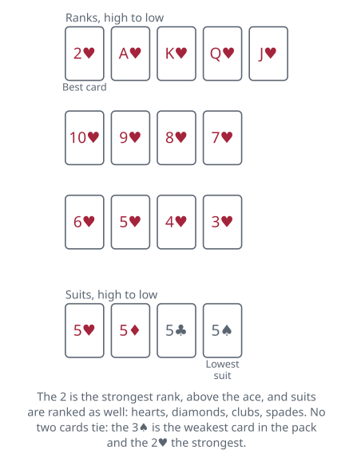
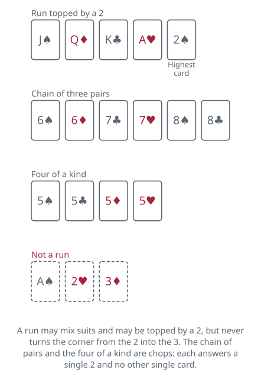

<!-- Generated by packages/build/render-markdown.ts from games/tien-len.json. Do not edit by hand. -->

# Tien Len

**Also known as:** Tiến Lên, Thirteen, Vietnamese Cards, VC, Killer 13, Advance  
**Players:** 2-4 players (best with 4)  
**Deck:** 1 standard deck (52 cards), jokers removed  
**Time:** 20-45 minutes  
**Difficulty:** Medium  
**Category:** Shedding  

## Setup

An ordinary 52-card pack with the jokers out. Choose a first dealer any way you like; after that the loser of each hand deals the next one. Thirteen cards go to each player, dealt one at a time, and thirteen is the hand size at any count from two to four: the leftover cards are set face down to one side and take no part in the game. Three players may agree on seventeen each instead, which leaves a single card over.

The rank order runs 3, 4, 5, 6, 7, 8, 9, 10, jack, queen, king, ace, 2, so the two is the strongest rank and the three the weakest. Suits are ranked as well, and that ranking settles comparisons all game rather than sitting idle: hearts are highest, then diamonds, then clubs, with spades lowest. Rank still comes first, so the lowest two beats the highest ace. Put the two together and every card has its own rung on one long ladder, from the three of spades at the bottom to the two of hearts at the very top. That top card is the reason the game needs bombs, since nothing in the ordinary run of play can touch it.

Whoever was dealt the three of spades leads the first hand of a session, that card being the lowest in the pack, and the opening play has to contain it. Accounts differ on how: one has the three led on its own, the other allows it inside a combination. Two variations loosen it: one lets that player lead anything at all, and another lets them pass instead of putting the three down. The reason to settle it before dealing is specific — a three tied up in a four of a kind is a chop you would rather not break. At two or three players the three of spades is often among the cards set aside, and the lead then belongs to whoever holds the lowest card that was dealt, by rank first and by suit between cards of equal rank. Later hands are opened by whoever won the previous one, though some tables hand the lead to the player who came last instead, as a small mercy.

## Play

A play is one of six shapes, and only these:

- A single card.
- A pair, two cards of the same rank.
- A triple, three of the same rank.
- A four of a kind.
- A run of three or more cards in consecutive ranks, suits freely mixed.
- A chain, three or more consecutive pairs, such as 6-6-7-7-8-8.

Runs and chains climb from the three upwards, and a two may cap a run: J-Q-K-A-2 is a legal sequence in both published accounts. What nothing does is turn the corner at the ends, so a run cannot be carried on past the two into the three, and A-2-3 is not a run.

Deal and play both run clockwise. One account lets a table agree on the opposite direction before starting; nothing else in the rules depends on it.

Going round the table, each player either passes or beats what is showing. A beat must be the same shape and, for runs and chains, the same length. Comparison is by the highest card in the play, and when two plays have the same top rank the suit of that top card decides. Two runs of four therefore settle on their fourth card and, if that is a nine in both, on which nine is the better suit.

Passing puts you out of the round. You take no further part until the round is finished, however tempting the play that comes round afterwards. One account makes a single exception, worth settling before the deal: a chop may be played even by somebody who has already passed. When everyone still in has passed, the last player to have put cards down clears the pile away and leads again with any shape they like.

Bombs, or chops. Since the two of hearts cannot be beaten by any ordinary single, the game supplies plays that break the shape-matching rule specifically to kill twos. Outside that job they are ordinary combinations: a four of a kind may be led like any other shape, and a chain of pairs the same. It is only as an answer to a two that either ignores the shape it is beating.

- A four of a kind, or a chain of three consecutive pairs or longer, beats any single two. Neither can be dropped on any other single card.
- A chop already on the table is answered only in its own shape — quad against quad, chain against chain of equal length, higher one wins. One account puts that as a general rule — once a chop is down, its shape is the shape everyone must match, in place of whatever was originally led. Whoever lays the chop that nobody answers takes the round in the ordinary way and leads next.
- Neither account ranks the two kinds of chop against each other, so a table that wants a four of a kind to outrank a chain of three pairs has to say so.
- More twos demand more. A pair of twos falls to a chain of four consecutive pairs or longer, and three twos to a chain of five or longer. One account also lets a plain four of a kind take a pair of twos and the other does not, which is worth settling. The American form raises the prices instead. Against a pair of twos it wants either a chain of five pairs or two fours of a kind in neighbouring ranks; against three twos, a chain of seven or three of them. Fix the schedule before dealing, because a player holding four sevens has already made plans around it.

The first player to run out of cards has won, and the rest carry on playing to sort out the remaining places, right down to the player who is left holding cards when everyone else is clear. A player who has gone out is skipped in the rotation, and if they were the one who won the last round, the lead passes on to the next player still holding cards.

## Goal & scoring

Shedding all thirteen cards first wins the hand. But the settlement both published accounts give runs the other way round, and it is worth getting straight before you play for anything: the hand runs on until only one player still holds cards, and whoever that is has lost and owes every other player the same agreed stake. Nothing is counted card by card, and second place buys nothing over third. One account puts the same rule in its friendly form — the loser buys the next round, or shuffles for the next hand, which is the same rule as the loser dealing.

A second scheme, given as one contributor's version, pays the winner one unit for every card each other player still holds. That one does make the gap between second and last a real one, since whoever finishes last is the player left holding the twos and broken runs nobody found a use for. Say which of the two you are playing before the first deal, because they are not close to each other.

Plenty of tables ignore units altogether and keep no score whatever, playing hand after hand purely for the order of finish and treating coming last twice running as its own punishment. If you do want a session result, agree a number of deals in advance and count first-place finishes, which suits the game better than a target score does; a target rewards whoever gets a hot deal late.

A hand claimed by an instant win, where the rules allow them, normally pays a fixed premium to the holder rather than being counted card by card, on the grounds that nobody had a chance to play at all.

## Variants

**Instant wins** — Certain dealt hands are shown immediately and take the hand before a card is played. All four twos is the one both accounts give, and only as part of the American form; a table that also plays with trading drops it, since a hand could otherwise be assembled rather than dealt. Six pairs among the thirteen cards, and a dragon — a run of all twelve ranks from the three up to the ace — are given here as well and rest on neither published account, as does the ruling that only a dragon topped by a higher-suited ace answers another. Far from universal, so check before you fan your cards out in triumph.

**Twos barred from runs** — The American form, recorded as Viet Cong or VC, keeps twos out of single sequences, so J-Q-K-A-2 stops being a run — though one account notes twos may still appear inside a chain of pairs. It strengthens the chops considerably, because a two then has no cheap way out of your hand: it has to be led and chopped, or held to the end and paid for. Note which way round this is. Both published accounts give the two capping a run as the ordinary rule, so this is the variation rather than the base.

**Chopping out of turn** — Many groups let a bomb be dropped the moment a two is played rather than waiting for the player's proper turn, with the rotation then resuming from whoever chopped. It makes leading a two a considerably more nervous act and speeds the hand up. Tables that require bombs to be played in turn get a slower, more positional game in which the order of seats matters a great deal.

**Penalties for what you never played** — An extra charge on top of the count of cards left, aimed at players who hoarded. Twos still in hand at the end are the usual target, at a couple of units each with red twos sometimes charged double, and an unplayed four of a kind or chain of pairs is charged more heavily still. Some tables also fine anyone who failed to put down a single card during the whole hand. The schedules vary wildly from group to group and are worth writing down before the first deal.

**Trading** — Two forms, both recorded. In the first, any two players may swap an equal number of cards after the deal and before the opening lead, by mutual agreement only — if they cannot agree on which cards, no trade happens. A table playing that way drops the automatic win for four twos. In the second, taken from President, the winner of the previous hand claims the loser's two best cards, and the runner-up claims the best card of whoever finished second from last; unwanted cards travel back the other way. The first form keeps the hands even and the second deliberately does not, so they pull the session in opposite directions: mutual trading is a negotiation, President-style trading is a handicap on whoever is already ahead.

**Other player counts** — Thirteen cards each and the remainder set aside unseen, exactly as at four players. Three may agree on seventeen each instead, which leaves one card over; one account gives that card to whoever leads, and the same account deals seventeen each at two players too. Five to eight can play with two packs shuffled together, taking thirteen each or as many as divide evenly. At two or three the large block of unknown cards means the counting that makes the four-handed game rewarding barely functions, and chops turn up far less predictably. The two-handed game in particular becomes a contest of who can force the other to break up a run first.

**Tags:** betting, classic, counting, strategy, two-player

*Rules checked against: Pagat, Wikipedia, Gambiter, Cool Old Games, Cats at Cards, Game Rules, CardRules+, Play Party Game, Everything2, Great Group Games.*

---

Part of [Naibi](../README.md). Text licensed [CC BY-SA 4.0](../LICENSE).
