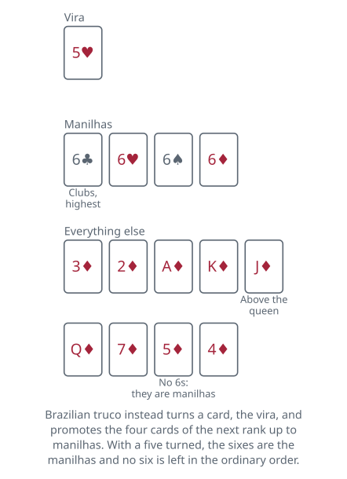

<!-- Generated by packages/build/render-markdown.ts from games/truco.json. Do not edit by hand. -->

# Truco

**Also known as:** Truco Argentino, Truco Uruguayo, Truco Paulista, Truco Mineiro  
**Players:** 2-6 players (best with 4)  
**Deck:** 1 standard deck stripped to 40 cards (8s, 9s and 10s removed), or a 40-card Spanish pack  
**Time:** 30-60 minutes  
**Difficulty:** Medium  
**Category:** Bluffing  

## Setup

Truco needs forty cards. The Spanish pack is the traditional one — coins, cups, swords and clubs, each suit running ace through seven and then sota, caballo and rey. An ordinary pack does the job once the eights, nines and tens come out: jack stands for the sota, queen for the caballo, king for the rey. Match the suits as well, because four named cards depend on it — swords are spades, clubs are clubs, cups are hearts and coins are diamonds.

Four players in two partnerships is the standard table, partners facing each other so the sides alternate. Two play head to head with nothing changed at all beyond the absence of partners, and six play as two teams of three seated alternately. Three is the awkward number: where it is played, the mano takes a fourth card, discards one face down, and plays alone against the other two. Five does not work at all; an odd fifth player sits out or keeps the score.

Deal three cards each, one at a time, to the right. Nothing is turned up in the Argentine game, nothing is drawn and nothing is exchanged: the three cards you are handed are the three you play. The player on the dealer's right is the mano. They lead to the first trick and — this matters far more than it sounds — they win every tie they are part of. Priority runs from the mano anticlockwise round to the dealer, who loses every tie; and a hand in which all three tricks are drawn goes to the mano's side outright. The deal moves one seat right afterwards.

Learn the ranking before the first hand rather than during it, because almost none of it can be guessed. Four cards stand apart at the top and are called the bravas; the seven of coins and the seven of swords, together with the ace of clubs and the ace of swords, have been lifted clean out of their ranks to form them, which leaves the other two aces and the other two sevens stranded lower down as the ases falsos and sietes falsos. Everything else is compared by rank alone, suits being otherwise meaningless.

Score with beans or matchsticks in two visible groups — twenty-eight of them is the traditional kit, fourteen a side, all returned to the pot and drawn out afresh when a side crosses into the second half. A game runs to thirty points, and the first fifteen are the malas and the second fifteen the buenas. Mostly that split is a way of saying the score aloud: nobody announces twenty-one, they announce six buenas. Some rule sets do hang the value of a bet on which half a side is in, and some do not, which is worth settling. A match is normally three games, best of them; playing just one to thirty — un treinta seco — settles an evening perfectly well.

## Play

A hand is three tricks, and the tricks are mostly there to give the betting something to be about.

The tricks. The mano leads, play goes to the right, one card each. The highest card takes the trick and its winner leads to the next. There is no trump suit and no obligation to follow suit — play whatever you like whenever it is your turn. A trick is a parda, a tie belonging to nobody, when the highest card played is matched by an opponent; two equal cards from the same partnership are not a parda, and that side simply takes the trick. Whoever led to a parda leads again to the next one.

Settling the hand takes five rules, and they are worth learning as a block because pardas turn up constantly. Take two tricks and the hand is yours. If the first trick is a parda, the hand goes to whoever wins the second, and if the second is a parda too, to whoever wins the third. If you won the first trick and the second is a parda, the hand is already yours and the third is not played. If each side has taken one trick and the third is a parda, the hand goes to whoever won the first. And if all three are pardas the mano's side takes it. As soon as the outcome is settled the remaining cards are thrown in unseen.

Two separate auctions run alongside those three tricks, and both are answered the same three ways: quiero to accept, no quiero to refuse, or a raise to the next rung.

Envido, on the cards you were dealt. Envido is a bet about who holds the best two cards of a single suit, and it is settled by saying a number out loud rather than by playing anything. Two cards of the same suit are worth their pips added together plus twenty, with sota, caballo and rey worth nothing at all; hold three of a suit and you count the best two of them. A hand with no two cards alike in suit counts only its highest single card, so three court cards in three different suits count zero. The floor is 0 and the ceiling is 33.

Any player may call envido and either opponent may answer for their side, but the window is narrow: you cannot open the envido once you have played your own first card, nor once you have accepted a bet on the truco. In practice the call comes from the pie — the last member of each side to play to the trick, and usually its captain — who has seen two or three cards go down first. Once a call is accepted, count round from the mano: the mano says a number, and each player after them either beats it aloud or concedes with son buenas. The highest number wins, and a tie goes to whichever of the tied players comes first going anticlockwise from the mano, so the dealer loses every tie they are in. The points go down immediately and the tricks carry on regardless of who won them.

The envido ladder accumulates rather than replaces. Envido is 2; a second envido on top of it makes 4; real envido adds three more, so envido then real envido is 5. Above everything sits falta envido, worth whatever the leading side still needs to finish the game — a bet that shrinks as that side closes on thirty, so it is as often a defensive call as a greedy one. The detail is not settled: some accounts price it off the losing side instead of the leading one, and some stop it at fifteen while the side in question is still in the malas. Agree which before you deal. Refusing any envido bet pays the caller whatever had already been accepted below the refused call, and never less than one, which is why a falta envido gets called far more often than it gets taken.

Truco, on the tricks. Truco stakes the whole hand, not the trick sitting in front of you. Any player may call it when it is their turn to play, and either opponent may answer for their side. The opponents accept, refuse, or accept and push it up to retruco — and those last two halves are not optional, because a raise offered without the word quiero in front of it is not a bet at all. The first side may then accept in turn and push again to vale cuatro. Refusing does not lose you the hand — it ends the hand, and the caller banks the lower amount without another card being turned. That is the engine of the whole game: you are betting far less on your cards than on whether the other side believes you have them.

Precedence. If truco is called while the envido is still live, the opponents may put an envido bet in before answering it, and the envido is then settled in full first. The truco call is still standing afterwards and has to be answered then. A flor announcement outranks both, and wipes out whatever envido betting has gone on before it — which is how a player holding three cards of a suit kills an accepted envido bet with a single word.

Talking. Truco is loud and the talk is part of the game rather than decoration. Verse, taunts, and flat lies about what you are holding are all normal and none of them are cheating. What makes the chatter dangerous is that the betting words are reserved: say one of them at a moment when the corresponding bet would be legal and you have made that bet, whatever you meant by it. Telling an opponent you do not want another drink has lost hands. Partners also signal their cards across the table with small movements of the face — raised eyebrows for the ace of swords, a kiss for a two, both eyes shut for a hopeless hand — and here, unlike in mus, a false signal is a legitimate weapon rather than an offence. The lists vary by region and a partnership may invent its own; the opposing pair are entitled to read anything they catch.

## Goal & scoring

A game is a race to thirty points and every one of them comes from a bet. The first fifteen are the malas and the last fifteen the buenas, which is mostly a way of saying the score aloud — six buenas rather than twenty-one — though some rule sets do price a falta envido or a contraflor al resto against which half a side is in.

The settlements are independent. The envido, the flor if you are playing with it, and the truco are three separate accounts, and a partnership can lose the tricks having already banked more from the envido than the hand was ever going to pay. That is a perfectly ordinary way to win a game, and it is why a hand with two high cards of one suit and nothing else is not a hand to fold.

Two principles govern the whole ladder. An accepted bet pays its own value to whichever side wins the thing it was about. A refused bet pays the caller straight away, at the value of the rung below the one refused, and closes that auction with nothing shown — so refusing an envido costs you almost nothing, and refusing a vale cuatro costs nearly as much as losing it would have. The consequence is that the ladder is not really a ladder of odds; it is a ladder of how much you are willing to be wrong by.

Score in the traditional way if you can, with matchsticks or beans laid out in groups and the malas kept on one side of the table and the buenas on the other. Everyone can then see at a glance what a falta envido is currently worth, which is information the game expects you to have.

| Scores | Value | Notes |
| --- | --- | --- |
| Hand won, truco never called | 1 | — |
| Truco | 2 | 1 to the caller if refused |
| Retruco | 3 | 2 if refused |
| Vale cuatro | 4 | 3 if refused |
| Envido | 2 | 1 if refused |
| Envido called a second time | 4 | 2 if refused |
| Real envido | 3 | on its own; refusal pays whatever was already staked, at least 1 |
| Envido, then real envido | 5 | the ladder accumulates; 2 if refused |
| Falta envido | what the leaders still need | to reach 30; some price it off the losing side, or stop at 15 in the malas |
| Flor | 3 | 3 for each flor announced, to the side holding the best one |
| Contraflor | 3 per flor | a challenge rather than a raise; conceding pays the winners 3 per flor plus 1 |
| Contraflor al resto | the game, plus 3 per flor | what the leading side needs to finish, plus 3 for every flor in play |
| Envido: two cards of one suit | pips added, plus 20 | — |
| Envido: sota, caballo, rey | 0 | — |
| Envido: no two cards alike in suit | highest single card | — |
| Best possible envido | 33 | the 7 and 6 of one suit |
| Worst possible envido | 0 | three court cards, no two of a suit |

## Variants

**Con flor** — Three cards of one suit is a flor, and at tables playing with it the holder must announce it during the first trick. Flor overrides the envido entirely: announcing it cancels any envido bet outstanding and replaces that account with its own, which can be pushed up to contraflor and then to contraflor al resto, staking the remainder of the game. Argentine tables divide roughly evenly between con flor and sin flor, and the choice completely changes what a suited hand is worth, so it is the first thing to agree on.

**Truco Paulista (Brazil)** — The best-known Brazilian form, and structurally a different game above the same three tricks. After the deal a card is turned as the vira, and the four cards of the rank immediately above it become the manilhas, ranked among themselves by suit: clubs highest, then hearts, spades, diamonds. The order wraps, so a turned 3 makes the 4s manilhas. Below them the ranks run 3, 2, ace, king, jack, queen, 7, 6, 5, 4, the jack sitting above the queen. There is no envido — the whole hand rides on the tricks. An untrucoed hand is worth 1 tento, truco makes it 3, and the raises are vale seis, vale nove and queda, which is the whole twelve-point game; a refusal pays the caller the rung below. The sting is the mão de onze: a side reaching eleven may pass its cards across the table to be read in silence, then choose either to play for three points or to throw the hand in for one, and calling truco at that score simply hands the opponents the game. With both sides on eleven it becomes a mão de ferro: nobody may look at their cards at all, each turns the top one over in turn, and the deal decides the match.

**Truco Mineiro (Brazil)** — Played like the Paulista game but with no vira turned. The four manilhas are fixed for every hand: the four of clubs, the seven of hearts, the ace of spades and the seven of diamonds, in that order, known as the zap, the escopeta, the espadilha and the pica-fumo — though the names travel badly and the south of Brazil calls the same four the gato, the copas, the espadilha and the mole. Removing the turn removes the one piece of shared information the Paulista game gives you, so every hand is read blind and the four special cards are memorised rather than worked out.

**Truco Uruguayo** — A card is turned as the muestra and left visible under the pack. Five cards of its suit — the two, four, five, caballo and sota — become piezas, outranking everything including the four bravas, which Uruguayans call matas. If the muestra card is itself one of those five, the rey of the suit is promoted in its place. Piezas count in the envido too, at fixed values well above anything an ordinary pair can reach, which pushes the best possible envido up to 37 and makes the envido round a far bigger part of the game than it is across the river.

**Two-handed truco** — Two players, three cards each, everything else identical: the same three tricks, the same envido ladder, the same truco ladder, the same thirty points. What changes is that no information can be signalled and none can be concealed behind a partner, so the whole hand is a direct reading contest, and the mano's tie-breaking advantage becomes the single most valuable thing on the table.

**Tags:** bluffing, classic, counting, partnership, strategy, two-player

*Rules checked against: Pagat, Wikipedia, Mundigames, Naipes Heraclio Fournier, Ludoteka, Conecta Games, GameVelvet, Arcadia Games.*

---

Part of [Naibi](../README.md). Text licensed [CC BY-SA 4.0](../LICENSE).
